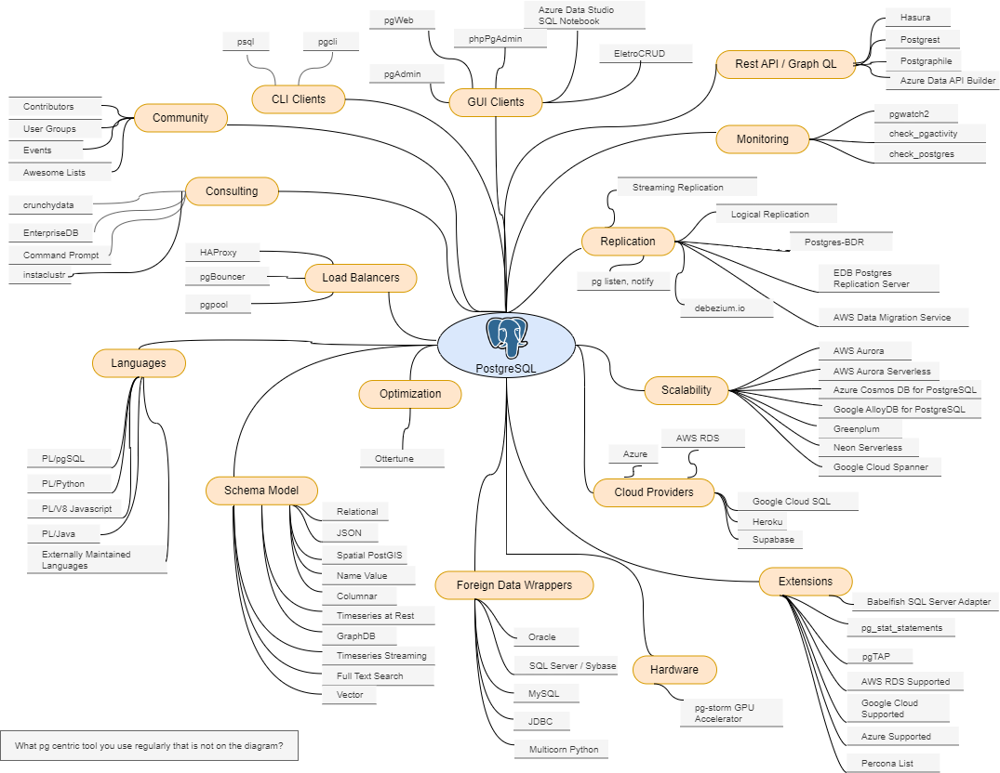

# postgresql-ecosystem 

<!-- https://stackoverflow.com/questions/3492153/markdown-open-a-new-window-link/5803384 -->
Overview of the capabilities and tooling directly tied to <a href="https://postgresql.org/" target="_blank">PostgreSQL</a>

(<a href="https://www.draw.io/?mode=github#HEfficiencyGeek%2Fpostgresql-ecosystem%2Fmaster%2Fpostgresql-ecosystem.drawio.png" target="_drawio">Click here to view/edit</a>) the diagram with hyperlinks, hosted by draw.io.

1. Why  
	1. To facilitate architecture design discussions on capabilities enabled by the PostgreSQL ecosystem.
	1. To increase the viability of PostgreSQL.
	1. To contribute back to the generous and supportive PostgreSQL community.

2. What
	1. A diagram of the key capabilities clustered with hyperlinked entities that enable each capability.
	
3. How  
	1. Open Source
		1. github.com
		2. draw.io
	1. Allow for PRs, collaboration.  
	1. With Hyperlinks to other sites.  
	1. Feedback to alex at efficiencygeek.com  

History:
1. August 2024
   1. Created a category - GenAI.
   1. Added [PostgresML](https://postgresml.org/blog), Full GenAI ML stack inside PostgreSQL.
   1. Added [postgres.new](https://supabase.com/blog/postgres-new), In-browser Postgres with an AI interface.
   1. Removed Ottertune, as it [shutdown as of 6/14/24](https://x.com/andy_pavlo/status/1801687420330770841).
   1. Removed Optimization category.   

1. December 2023
   1. Added Google Cloud Spanner.
   1. Added Azure Data API Builder.
   1. Added Vector Schema Model.
   1. Removed Swarm64 as it was purchased by ServiceNow.
   1. Updated certain links to be more topic specific.
   2. Updated diagram file format to an editable bitmapped image (drawio.png) and simplify edit and display of the drawio file.   
1. November 2022
   1. Added [Ottertune](https://ottertune.com/postgresql/), Machine learning augmtented tuning for PostgreSQL.  
   2. Added a new category Optimization to match.	
2. October 2022  
   1. Added [Neon Serverless](https://neon.tech/).  
   2. Added [Azure Cosmos DB for PostgreSQL](https://learn.microsoft.com/en-us/azure/cosmos-db/postgresql/introduction).  
   3. Added [Google Cloud AlloyDB for PostgreSQL](https://cloud.google.com/alloydb).  
3. September 2022  
   1. Added [Supabase](https://supabase.com/database) as a Cloud Provider.
   2. Added referrence to original Chicago PUG presentation (see October 2019 below).
4. November 2021  
   1. Added [Babelfish SQL Server Adapter](https://babelfishpg.org/blog/releases/2021/10/babelfish-launch/).
5. Febuary 23, 2021
   1. Referenced by Marco Slot of Microsoft Citus Data in this presentation [Citus: Distributed PostgreSQL as an Extension Vaccination Database Talks Carnegie Mellon](https://youtu.be/X-aAgXJZRqM?t=207)
6. October 2019 - MMF1 
   1.  Presented [this deck](presentations/postgresql-ecosystem-CHI_PUG-20191016.pptx) at the [Chicago PostgreSQL Users' Group October 2019](https://www.meetup.com/chicago-postgresql-user-group/events/265263425/).
	1.	Complete Data on Categories, Nodes with Links
    1. 	Embed static image into this github repo, and just do a save as image from draw.io.	

Backlog:  
1. Embed static diagram directly linked to draw.io, avoiding the save as image step.

Thumbnail Link:  

